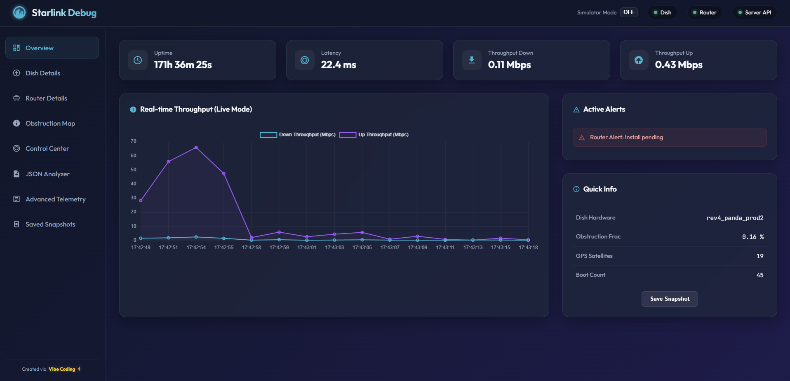
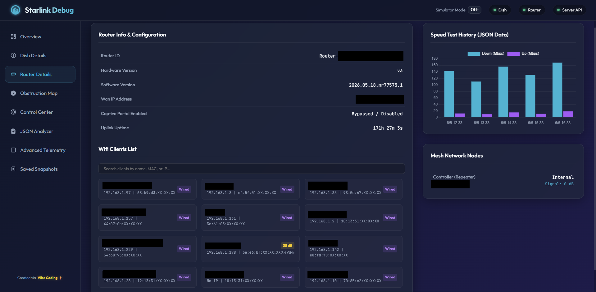
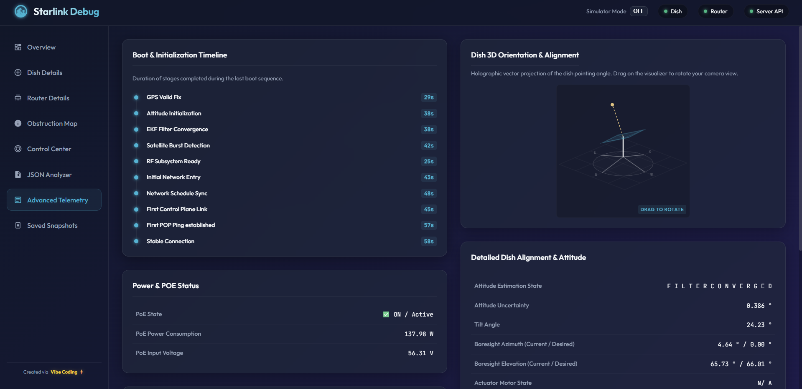

# Starlink Debug PC Dashboard

A premium space-themed desktop web dashboard to monitor and control Starlink Dish and Router, built as a replica of the original `star-debug` mobile application.

This repository contains:
1. **Frontend (`dashboard/index.html`)**: A lightweight, single-page web dashboard using Vanilla HTML, CSS, and JS (with Chart.js).
2. **Backend (`dashboard/star_debug_server.py`)**: A zero-dependency Python HTTP server that acts as a bridge between the browser and the Starlink gRPC endpoints.
3. **Launcher (`run_dashboard.bat`)**: A double-clickable batch launcher for Windows.

---

## 📸 Screenshots

### Dashboard Overview


### Router Details & Client List


### Advanced Telemetry & 3D Dish Orientation


---

## 🚀 Features

- **Advanced Telemetry & Diagnostics**: Monitors uptime, throughput, latency, POE power consumption, detailed alignment angles, signal quality, and calibration flags.
- **Interactive 3D Holographic Dish Visualizer**: Renders a glowing wireframe vector model of the dish face. The model rotates (yaw/azimuth) and tilts (pitch/elevation) dynamically based on telemetry. **Drag the mouse over the canvas to rotate the camera viewpoint in 3D!**
- **Obstruction Maps**: Dual visualization using polar sector obstruction wedges and live 2D signal canvas maps.
- **Ready States Guide**: Displays system status (`Cady`, `Scp`, `L1/L2`, etc.) with inline explanations underneath so engineering terms are clear.
- **Control Center**: Reboot the Dish/Router, toggle stow/unstow, or configure GPS and RF transmission.
- **JSON Analyzer (Offline Mode)**: Drag-and-drop or paste `DebugData.json` files to inspect telemetry offline without any running backend.
- **Saved Snapshots**: Save, load, and delete telemetry snapshots inside your browser's local database.

---

## 🛠️ How to Run Locally

### Prerequisites
Install [uv](https://docs.astral.sh/uv/getting-started/installation/), then install dependencies:
```bash
uv sync
```

### Option A: Launcher (Windows)
Double-click the **`run_dashboard.bat`** script in the root folder. It will start the server and automatically open the dashboard in your default browser at:
`http://localhost:8000/`

> Requires uv to be installed and available on PATH.

### Option B: Command Line (All Platforms)
```bash
uv run dashboard/star_debug_server.py
```
*Tip: If you are not connected to a Starlink network, run with the `--mock` flag to boot into simulation mode:*
```bash
uv run dashboard/star_debug_server.py --mock
```

### Running Tests
```bash
uv run pytest
```

---

## ⚡ Vibe Coding

Developed via Vibe Coding.

---

## 📄 Attribution & License

This project is a derivative work and a complete web rewrite inspired by the original **`star-debug`** mobile application created by **Ihor Lytvynenko**. 

The original software code, stubs, and assets are licensed under the **BSD 3-Clause License** (included in `LICENSE.md`). This web dashboard is released under the same terms:
- Copyright © 2023, Ihor Lytvynenko. All rights reserved.
- Rewritten Web Frontend & Python Backend Copyright © 2026.

Redistribution and use in source and binary forms are fully permitted under the terms of the BSD license, provided that the original copyright notices are retained.
